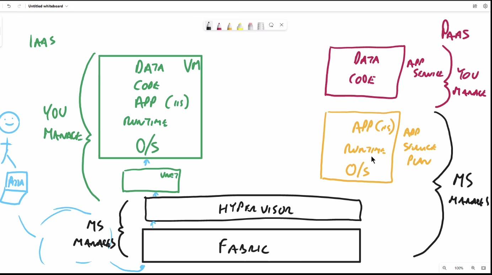

## links

first session instructor (sky devops Azure program): sean.carvin@qa.com

next session: https://qa-learning.webex.com/qa-learning/j.php?MTID=m85065d67a8a7ff22d9c7c9258a894920

### introducing sky

### introducing ourselves

### Microsoft Azure Fundamentals
- skillpipe fundamentals 

- https://miro.com/app/board/uXjVOoGgO6s=/?moveToWidget=3458764530411932521&cot=14

- course in one day

  #### food delivery business startup needs

  - server location closest to the users (most customers and businesses)
  - split the servers up to be in prime locations
    - to reduce lag/latency
  - 10 servers in farm (quite, midnight to mid day), 100 servers in farm (busy mid day to midnight)
  - 100 servers (enough for the busiest time)
  - bandwidth over power
  - £200 for **renting** individual server
    - £20k for renting out 100 servers
  - £5000-£20,000, £5k (just need basic servers to distribute)
    - £500k

- every day something is changing in the cloud

- 

- IAAS = infrastructure as a service 
- PAAS = platform as a service

- **service level agreement**, the basic promise that the provider gives you (server will be active for 23hrs/day or be compensated)

  - Microsoft managed disk is 99.9% SLA
  - personally managed disk is 99.5% SLA

- **shared responsiblity model**:

  - provider has responsibility 
  - user has responsibility 

- private cloud: your own company's servers/racks (fully your responsibility)

- public cloud: where the shared responsibility principle occurs, AWS/GCP/Azure

- hybrid cloud: for sensitive data sometimes (not wanting to store info on public cloud), mostly a transitional phase though

  - public cloud has a lot more security

  

CapEx vs OpEx

### creating azure VM

1. create resource group
2. create VM
   1. fill out configuration 

storage component is paid 24/7 because you are always storing information

**High Availability**

as much uptime as possible, in all regions that are available

**Scalability**

add/remove resources whenever needed. Vertical or Horizontal, more machines or a more powerful machine

(Elasticity: *automated scaling*)

**Reliability**

having no (or little) failures in any systems, and whenever something does occur: being easily fixable. Having multiple places to house the data. *mean time between failure*, fault tolerance 

**Predictability**

always have an easy to understand and predict metric (data transfer/cost etc.) and the UI predictability 

virtual machines are easy to rebuild (and reallocate to other CPU and RAM), but what's difficult to rebuild is data, so Azure (and other cloud solutions) keep 3 copies total of your data, so if one fails: no data is lost.

### Subscription 

- billing
- management
- virtual machines

### Azure Active Directory (AAD)

- identifier
- users
- user groups
- can include a user from another business AAD into yours (Business to Business)
- can include an external app (twitter/Facebook) to use as an AAD user (Business to Customer)

linking a user to **instance** is called an **association**

there will be multiple subscriptions, because there is a clear seperation of VMs and instances

One to *Many* (AAD -> subscription)

Many to *One* (subscription -> AAD), CANNOT ASSOCIATE MULTIPLE AADs to a single subscription

**resource group**: management bucket

- resources are actual objects
- resources are associated to **one** resource group
- in the same resource groups are (normally):
  - objects that have the same longevity
  - objects which have the same department

**CANNOT BUILD ANYTHING WITHOUT HAVING RESOURCE GROUP AND SUBSCIPTION**

small disk = 32gb

**Region**: physical location in the world where microsoft has datacenters

**Geography**: a border which the region pairs exist in

​	-> region pairs, UK east & UK west (pairings to make sure high availability and reliablitity is guaranteed)

racks in a data center each have their own power + network

**Fault Domain (FD)**: rack of servers in a data center

**Update Domain (UD)**: row of a Fault Domain where MS does its update

**Availability Set**: guarantees that distributed VMs and resources are not in the same FD + UD (^ SLA to 99.95)

**Availability Zone**: collection of 1 or more data center, distributes between data centres to further increase SLA (^ SLA to 99.99)

Containerising allows for data and code with just enough app and OS, using **Docker**.

**Kubernetes** orchestrates containers. essentially scaling.

can scale horizontally automatically as there is no down time as it is adding to the VM sets, but vertically requires downtime as it needs to shut down and restart VM.

**functions**: serverless, event based code

**App service**: used in PAAS (Platform as a service), easier to set up than VM (as more is handles by provider)

### storage

- **containers**: unstructured storage (blobs)
  - Hot: frequently accessed data (storage is expensive, egress is cheap)
  - Cold: not frequently accessed data (storage is less expensive, egress is expensive)
  - Archived: not easy to access. Egress is difficult

**layered security**: physical security, firewalls etc.

**zero trust**: treasting in person the same as remote
