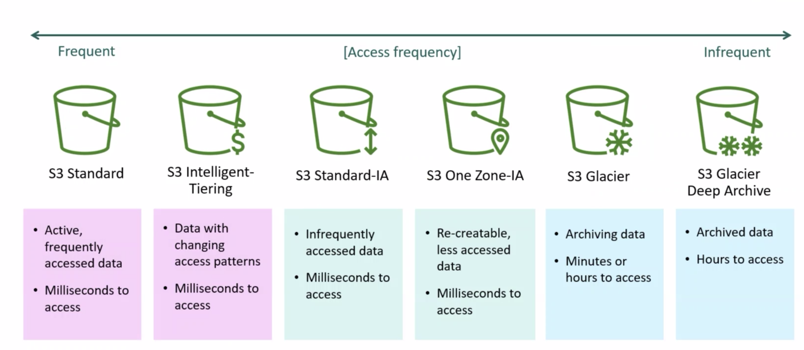
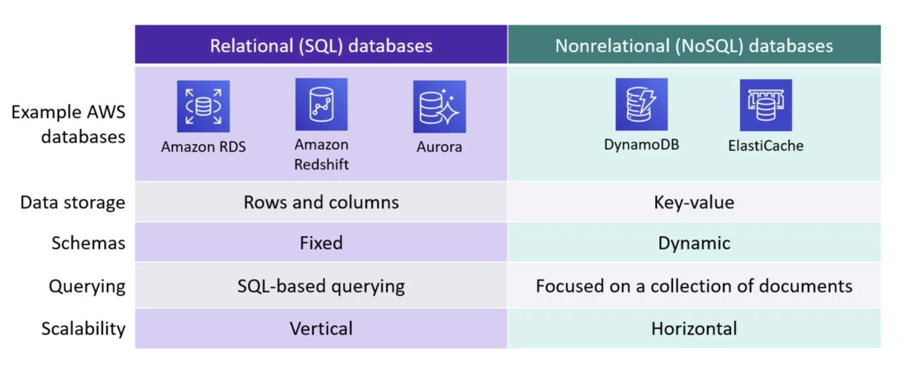

## EC2 pricing options

**spot instances**: bidding for an unused spot on a machine. If you are outbid, you'll have a 2 minutes to raise your bid (normally 70%-90% cheaper than regular)

best idea to combining instance plans

- on demand
- spot instance
- compute savings plans
- EC2 savings plans

if placement groups not defined, instances boot in random locations. If they are, you can specify the availability zone etc.

- **spread placement group**: spreading different hardware in different availability zones
- **partitioned placement group**: spreading storage so you don't have to queue as much

serverless computing (**lambda**) runs on a server, but it is abstracted from user

**lambda at edge** pushes the functions closer to the user, moving code to region closest to the user

**lambda functions** can be allocated up to 10gb

**lambda functions** can run for a maximum of 15 minutes

## Storage

- **block storage**: raw storage, data organised as array of unrelated blocks (hard drive in the cloud)
- **file storage**: unrelated data blocks managed by a file serving system. Native file system places data on disk. NAS on the cloud
- **object storage**: stores virtual containers that encapsulates the data, data attributes, metadata and Object IDs. like dropbox.

**S3 storage**: WORM (Write Once Read Many), _object storage_.

- global service, globally accessible (can still pick region to sit in)
- URL to access objects
- access points for letting different ways to access the buckets
  - each access point can have permissions
- can host static web pages with low downloads
- _unlimited_ storage, as many objects as you want
- 5TB individual object limit
- different tiers of S3 storage
  - Standard ***(hottest)***
  - I.A, infrequent access ***(hotter)***
    - once every 30 days access
  - I.A - 1 AZ. infrequent access - 1 availability zone ***(colder)***
    - normally data is replicated across 3 AZs in region, this restricts to 1 AZ.
  - Glacier ***(coldest)***
    - archived storage
- soft limit: 100 buckets per account per region
- pay for how much data you store & data egress

using the AWS backbone to access storage can give you better or worse. you can use speed comparison to dictate the flow of the data

**Instance level storage**: is deleted when an instance is deleted. Volatile storage.

**Elastic Block store (EBS)**: is not deleted: static, block level storage. Attach EC2 instance to EBS volume

- pay for how big the disk itself is
- EBS multi attach: attach up to 16 devices
- block level storage (harddrive in cloud)

**Elastic File Service (EFS)**: file level storage. 

- has point of connectivity. The _mount point_
- can go accross avilability zones and regions
- mount point connects to the EFS
- EFS connects to the hard drive itself
- used with ECs linux machines
- The windows alternative is called ***File System [X] (FSX)***
- you can share the same hard drive between EFS and FSX
  - if the speficic OSs are compatible 

some S3 use cases

- backup and restore
- business critical applications

S3 stores data as *objects* in *buckets*

- buckets are not publically available by default
- at first it wasnt so there are some buckets still public online

Macie is a tool that can find your buckets that may not be intended to be public

consider the impact of storage on environment 

**Glacier**: very long term storage for information that doesn't get used at all but may be legally obligated to keep

- different ways to take data out of glacier
  - expedited
  - standard
  - Batch

can encrypt data, this is the default option (s3 buckets have encryption off by default)

- S3 standard encryption
- AWS KMS (Key Management Service)
- Customer managed key (supply your own key)

S3 buckets can trigger lambda functions

multipart upload is available (with the use of the AWS SDK, not just CLI)

**AWS snowball**: hard drive (storage device), sent out to your data center to copy over data to migrate. big physical box

**AWS snow cone**: like a snowball, but smaller box

**AWS snow mobile**: truck that is like a snowball

## Database services

choosing a data store:

- schema backed?
- Relational?

MS Aurora is a schema based SQL database solution, which is well maintained.

Dynamo DB can scale both ways (horizontal or vertical)

- has consistency options (consistent vs available)

redshift can be used as data warehouse

## cloudwatch

- the best way to log infiormation
- can send notifications via SNS
  - costs per message
- doesn't want to report memory
  - security risk

Eventbridge, is a if this then that system based on monitoring 

**types of load balancers**:

- Application 
- Network
- Gateway
- Classic

when monitoring CPUs, autoscaling samples the average of all machine CPUs. Through this, there can be boundaries implemented

once you set the auto scaling group maximum, even if it's above the metric it won't create another

as the Autoscale group there is a **warmup** period. If it requires another 2 instances to get the CPU usage under the specified metric but there is some instance instance already booting: it would only boot another 1 machine because the asutoscaling hasn't seen the effect of the 1st machine.

- start autoscaling at ~70% ***not*** 99% as it will not boot up instances in time before denial of service

there is also a **cooldown** period, where machines take time to shut down. not as important as warmup

**components**

- launch configuration (or launch template)
- Auto scaling group (ASG)
- auto scaling policy

use ***warm pool*** to lower costs

- warm pool are previously built instances that you can easily start instead of building whole new ones, can have warm pool in different states
  - stopped (only pay for disk)
  - Running (not paying for throughput & licence)
  - Hiberating