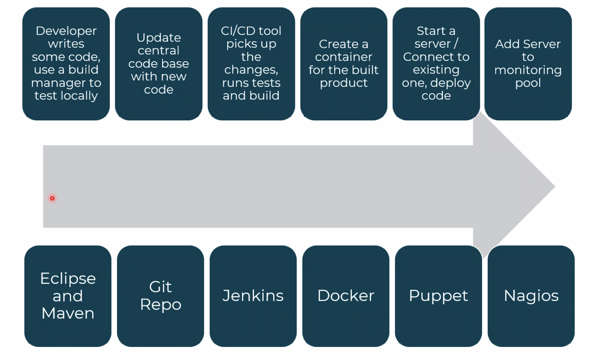

## Python & Cyber security

### CICID

Continuous Integration / Continuous Delivery 

Devops is a combination of deveopment and operations. Developers were not worried about production and Operations were not skilled as developers.

**Continuous Delivery or Continuous Deployment**

Continuous Delivery:

- is able to be delivered or deployed
- sometimes one person can verify it is deployable
- other times the main branch is just ready to push

Continuous Deployment:

- always deployed

Non-functional requirements, the DevOps requirements:

- Scalability
- Reliability
- Accessible 

**automation** is a key part of DevOps

most resources at sky are AWS, but GCP is also utilised

feature switch is using individual building blocks building towards a feature and testing that, because there are 2 week sprints at sky so a feature may not be able to be completed by then.

Kanban:

- todo
- doing
- done

**technical debt**: the shortcut way will have an impact of future decisions (like interest)

pillars of agile: Visibility

**C**ulture.

- no blaming
- no silos

**A**utomation

- automate everything

**L**ean

- product value for the end user
- less waste in system

**M**etrics

- measure everything
- what works, what didn't, how do we fix this?

**S**haring

- learning from our mistakes

book recommendation: The pheonix project

chaos engineering:

 - netflix origin. Simian army to test recovery and preparedness
   - chaos monkey, shuts down services
   - janitor monkey, checks for usless processes

sky do not have a _specific_ stack

sky does not have a specifc DevOps toolchain

**cycle time**: amount of time between starting feature and releasing it

trying to get away from waterfall redtape riddled, time sensitive method. Move towards testing focused method.

**Value of Automation**:

- consistency
- platforms
- faster repairs (automation of repairs)

**Pillars of DevOps**:

- Continuous integration and continuous delivery
- cloud and virtualisation
- automation and orchestration
- monitoring and logging
- Optimisation, testing, and performance

Amazon invented the cloud to keep profits up during black friday. Other times, they would loan it out to others.

**DevOps Tooling**

The DevOps toolset aimed at supporting pillars:

1. automation is key
2. testing everything
3. monitoring & catch problems

there should be an ease to swap in and out without breaking the entire chain

**Jenkins**: can set to look for when teammates push to a specific branch (using webhooks) which starts a job and runs tests + build

**Docker**: wraps the code into a self contained container to be drployed anywhere.

**IT problems**: 03331006000

**shifting left**: thinking earlier to implement testing/security design

## Git

**git init**: start local repo

**git add**: adds file to be tracked

**git commit (-m message)**: commits the changes with a meaningful standadised message

**git push**: pushes to a remote directory

keep regular merging with main branch

**IaC**: Infrastructure as Code, the use of high end coding language to produce an environment for testing

- faster time to production/market
- less configuration drift
- Faster more efficient development
- protection against staff churn
- lower costs and improved quality
- aufitable changes stored in version control repositories

immutable vs mutable infrastructure:

- in the testing of IaC, can users change the specifications of the infrastructure
- immutable is more short term, not patches.
- mutable is long term, always evolving.

**Terraform** is immutable. Other tools can make changes (***like puppet***)

Tests should be treated as important, but testing is not going to save the project.

**unit testing**: testing the building blocks of the program

**Pareto Principle**: 80% of outcomes come from 20% of the inputs

**Continuous Monitoring**: notify devs & quality assurance teams about problems that have come up

- The failing notification: telling you that a process has failed (not great)
- The potential failure notification: telling you something might fail
  - can prevent it
  - can watch why it fails

**alerts**: 

	- Reactive (RED): something is broken
	- Predictive (YELLOW): something will fail
	- Informative (GREEN): this is occuring at the time of the alert

**Devops Metrics**:

1. **Deployment/Release Frequency**
   - 208x improvement over traditional
2. **Change Lead time (Cycle Time)**
   - 106x improvement over traditional
3. **Mean Time to Restore Service (MTTR)**
   - 2604x improvement over traditional
4. **Change Failure Rate (CFR)**
   - reduction by 7x

**microservices**

a _monolith_ is a large executable 

- scaling requires to scale entire thing

microservices are loosely coupled distributed autonomous services

- loose coupling: having components depend on each other in the least extent possible
- high cohension: everything is related and is combined

many microservices orchastrated together is a complex system

_best practices_:

1. keep test/stage environments as close to production as possible
2. one service per host minimizes impact of one service on others and impact of a host outage

**Containerisation**:

- Docker
- RKT (Rocket)
- windows containers
- linux containers

## Docker

(-d) : detatched mode

(-p): expose ports 

**docker ps (-a)** - shows all running containers (any process regardless of running or not)

**docker images** - shows all images that are local

**docker exec -it [docker container name] bash** - create bash shell to execute commands in container

**docker stop [first 4 digits of id]** - stops container

**docker rm** - delete container

**docker rmi** - delete image

### Dockerfile

files to create a custom image

- ***FROM***: what is the base image to base on
- ***CMD***: a command to feed the base image
- ***CP***: copies files

**docker build -t** (tags) **hello** (name) **.** (Context)