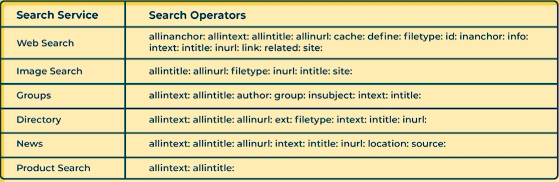

## Protective monitoring

**SIEM**: Security information and event management

**polymorphic malware**: malware that changes its signature 

- **worms**
  - self relicating
  - human interaction required
  - aim to deliver malicious payload + more to spread
- **trojans**
  - Non-self replicating
  - gains access to OS by appearing as a desirable application
  - Injects malicious code while performing legitimate functions 
- **adware & spyware**
  - software for generating revenue from display of ads
  - spyware gathers information about the system it is installed on
- **Ransomware**
  - deny access to computer resources, requiring a ransom to be paid
  - sophisticated RW can interfere with backups
  - cryptolocker sent via emails
- **Rootkit**
  - kernel level rootkits infects kernel itself making it difficult to detect
  - firmware level rootkits attacks BIOS and are also hard to find
  - hypervisor level rootkits, also very hard to find
- **keylogger**
  - captures keypresses from users

in DDoS, there are:

- infected computers (zombies)
- command and control servers (C&C servers)
- Botmasters

zombies/bots are usually created using malware

some botnets are shared

**types of DDoS**:

- ping or ICMP flood
  - Overwhelming server with ping
  - dependant on how hacker gets IP
  - router disclosed ping flood, router goes down along with connected devices
- SYN flood
  - sending SYN messages (part of TCP 3 way handshake to establish connection)
  - server responds with SYN/ACK and expects an ACK from client
  - client can choose either not to respond or spoof source IP sent in SYN message so real computer never responds with ACK (it hasn't sent a SYN)

**APT**: Advanced Persistent Threats (major states or sophisticated cyber criminals)

- maintain a system presence on network (not needing to reinfect network: open backdoor)
- Steps:
  1. intelligence gathering
  2. point of entry
  3. command and control communication
  4. lateral movement and persistence 
  5. Asset/data discovery
  6. Data exfiltration
- end goal is to stealthily steal data
- the same solution is not possible for all attackers

**approaches to data monitoring**: 

- Basic alerting
  - indicate interesting type of event has ocured
- Baselining 
  - Define normal vs. unsual events
  - compare with new data to detect changes
  - thresholding is the identification of data exceeding a baseline 
- windowing 
  - detection of events within parameters
- correlation
  - relationships among events

**encrpytion**

- encoding informtion so only those authorised can read
- does not prevent data interception or theft, just protects content

**plaintext**: unencrpyted text

**data in transit**: information moving across a network

**data at rest**: information being stored, protected through OS tools and encryption

**hashing**: type of encryption that proves integrity of data

## cipher classification

- **symmetrical key ciphers**: 1 key for both enc and dec
  - take secret key, encrypt, send data,
- **asymetrical key ciphers**: 2 keys, one for enc the other for dec
  - public and private keys, public keys are shared, private keys are for yourself
  - allows the ability to send public keys without risk
  - CA (Certification Authority) needs to verify you are you before giving a public key
    - this is done using the CAs private key
    - TTP (trusted third party)
    - maintains a list of invalid (revoked) keys
    - Online Certificate Status Protocol (OCSP)
    - can also provide **digital signature** authentication
      - hashed value that verifies that it is you
      - hashed from your private key
        - low probability of same hash 
- **stream ciphers**: encrypted continuous streams of data (e.g. in mobile phone comms)
- **block ciphers**: encrpyted blocks of fixed size

## Digital Footprints

anything that is done leaves a trail

the association of the data to an individual is what builds the online identity (digital profile)

examples of times your presence may be shared:

1. social network
2. gaming
3. political views
4. criminal history
5. education
6. financial records

data can be shared to malicious entities

friends and family who are not as secure as you can breach your security

DNS record (whois) used to be able to disclose infromation about visitors etc. after GDPR, this is not the case in Europe

websites for matching your physcial location to your internet location

- Yougotsignal.com
- infosniffer.net

different search engines index different sites, and google only indexes around 2.5% of the web

**deep web**: the other 96% of the web, that is not reachable by google (non indexed)

**dark web**: darker shady part of the web

how do search engines work?

1. deploy automated programs to spider/crawl across webpages
2. Information fed to algorithms that ranks pages against the search criteria

other search engines: Bing, Baidu, Ask, Yandex, Wolframalpha, Dogpile etc.

**Wolframalpha** is a different take on search engines, instead using crawling and algorithms to find answers to questions 

**DuckDuckGo** is a search engine with privacy designed in mind, mitigating the search bubble effect

**keyword.io**: keyword based search engine that generates suggested keywords for searches

## Google Operators and Google hacking

NameChk.com, Archive.org

**pastebin**: originally for sharing code extracts, only text can be shared but media can be encoded in text form, used to share stolen information

deepweb search resources:

- flightradar24.com
- blackbookonline.info
- humantraffickingsearch.net

**Open Source Intelligence (OSINT)**: pool of information into one research tool

## Risk Assessement

phase 1: business impact assessment

phase 2: threat and vulnerability assessment

phase 3: control selection

- process of defining the level of risk that exists in any given activity using the risk equation
- identify, quantify and prioritise information security risks
- ongoing oractice
- take into account entire organisation
- have pre-defined scope

choosing the right methodology:

- scope
- resources
- ease of use
- cost

legal and regulatory requirements:

- PCI-DSS: card payment security and reduce fraud
- GDPR: standardize approach to data across EU
- Security policy framework (SPF): policies on security relating to the government and its suppliers

